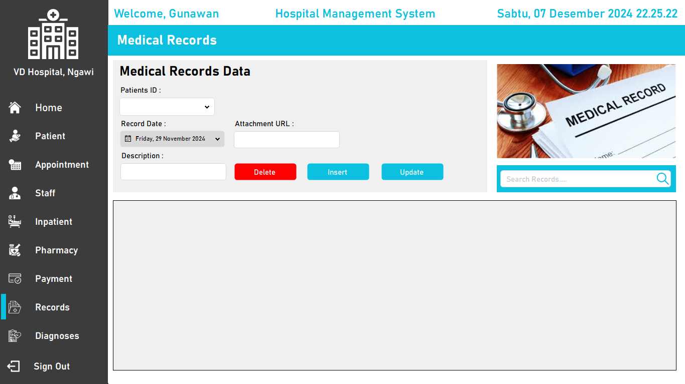
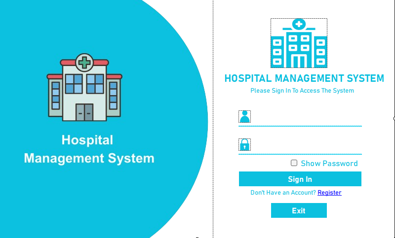
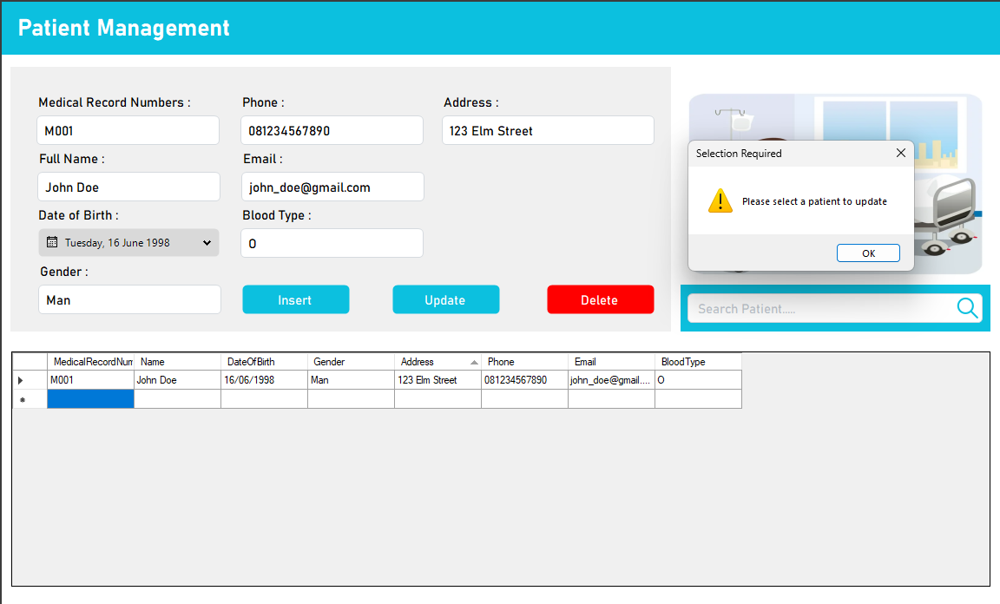

# 🏥 Hospital Management System

<div align="center">
  


**Sistem Manajemen Rumah Sakit Modern**

*Project pertama saya menggunakan C# - Desember 2024* ✨

[📋 Fitur](#-fitur) • [🚀 Instalasi](#-instalasi) • [📸 Screenshots](#-screenshots) • [🛠️ Tech Stack](#️-tech-stack)

</div>

---

## 🌟 Tentang Project

Hospital Management System adalah aplikasi desktop yang dirancang untuk memudahkan pengelolaan administrasi rumah sakit. Project ini merupakan **langkah pertama saya dalam dunia C#** yang dikembangkan pada akhir Desember 2024.

> 💡 **Catatan**: Sebagai project pembelajaran pertama, sistem ini fokus pada implementasi konsep dasar C# dan Windows Forms dengan antarmuka yang user-friendly.

## ✨ Fitur

### 👥 Manajemen Pasien
- ✅ Registrasi pasien baru
- ✅ Edit dan update data pasien
- ✅ Pencarian pasien berdasarkan ID/Nama
- ✅ Riwayat kunjungan pasien

### 👨‍⚕️ Manajemen Dokter
- ✅ Database dokter lengkap
- ✅ Jadwal praktek dokter
- ✅ Spesialisasi dan pengalaman
- ✅ Status ketersediaan

### 📅 Sistem Appointment
- ✅ Booking janji temu
- ✅ Konfirmasi dan pembatalan
- ✅ Reminder otomatis
- ✅ Manajemen antrian

### 💊 Manajemen Obat
- ✅ Inventory obat
- ✅ Resep elektronik
- ✅ Stock monitoring
- ✅ Expired date tracking

### 💰 Billing & Payment
- ✅ Generate invoice
- ✅ Payment tracking
- ✅ Insurance handling
- ✅ Financial reports

## 🛠️ Tech Stack

| Kategori | Teknologi |
|----------|-----------|
| **Language** | C# (.NET Framework) |
| **UI Framework** | Windows Forms |
| **Database** | Microsoft SQL Server |
| **IDE** | Visual Studio 2022 |
| **Design Pattern** | MVC (Model-View-Controller) |

## 🚀 Instalasi

### Prerequisites
- Windows 10/11
- .NET Framework 4.7.2 atau lebih tinggi
- SQL Server 2019+ atau SQL Server Express
- Visual Studio 2019+ (optional, untuk development)

### Langkah Instalasi

1. **Clone Repository**
   ```bash
   git clone https://github.com/yourusername/hospital-management-system.git
   cd hospital-management-system
   ```

2. **Setup Database**
   ```sql
   -- Jalankan script SQL yang tersedia di folder /Database
   -- Atau restore backup database HospitalDB.bak
   ```

3. **Configuration**
   ```csharp
   // Update connection string di App.config
   <connectionStrings>
     <add name="HospitalDB" 
          connectionString="Server=localhost;Database=HospitalDB;Integrated Security=true;" />
   </connectionStrings>
   ```

4. **Build & Run**
   ```bash
   # Menggunakan Visual Studio
   # Buka solution file (.sln) dan tekan F5
   
   # Atau menggunakan command line
   dotnet build
   dotnet run
   ```

## 📸 Screenshots

<div align="center">

### 🏠 Dashboard Utama


### 👤 Tampilan Register


### 📊 Manajemen Pasien


</div>

## 🏗️ Struktur Project

```
hospital-management-system/
├── 📁 HospitalMS/
│   ├── 📁 Forms/              # Windows Forms UI
│   ├── 📁 Models/             # Data Models
│   ├── 📁 Controllers/        # Business Logic
│   ├── 📁 Database/           # Database Scripts
│   ├── 📁 Resources/          # Images, Icons
│   └── 📄 Program.cs          # Entry Point
├── 📁 Documentation/
├── 📄 README.md
└── 📄 LICENSE
```

## 🎯 Roadmap

- [ ] **Phase 1**: Core Functionality ✅
- [ ] **Phase 2**: Advanced Reporting
- [ ] **Phase 3**: Web Integration
- [ ] **Phase 4**: Mobile App Support
- [ ] **Phase 5**: AI Integration

## 🤝 Contributing

Sebagai project pembelajaran, saya sangat terbuka untuk:
- 🐛 Bug reports
- 💡 Feature suggestions  
- 📝 Code improvements
- 🎨 UI/UX enhancements

### How to Contribute
1. Fork the project
2. Create feature branch (`git checkout -b feature/AmazingFeature`)
3. Commit changes (`git commit -m 'Add some AmazingFeature'`)
4. Push to branch (`git push origin feature/AmazingFeature`)
5. Open a Pull Request

## 📚 Lessons Learned

Sebagai project C# pertama saya, beberapa hal yang saya pelajari:

- **OOP Concepts**: Implementasi Inheritance, Polymorphism, Encapsulation
- **Windows Forms**: Event-driven programming dan UI design
- **Database Integration**: ADO.NET dan SQL Server connectivity
- **Design Patterns**: MVC pattern untuk clean architecture
- **Error Handling**: Try-catch blocks dan exception management

## 🔧 Challenges & Solutions

| Challenge | Solution |
|-----------|----------|
| Database Connection | Implemented connection pooling |
| UI Responsiveness | Async/await patterns |
| Data Validation | Custom validation classes |
| Security | SQL injection prevention |

## 📝 License

Distributed under the MIT License. See `LICENSE` for more information.

## 👨‍💻 About Developer

**First C# Project Journey** 🚀

Ini adalah langkah pertama saya dalam eksplorasi C# dan .NET ecosystem. Project ini dikembangkan sebagai pembelajaran praktis untuk memahami:
- Object-Oriented Programming dengan C#
- Windows Forms development
- Database integration patterns
- Software architecture principles

## 📞 Contact & Support

<div align="center">

[](https://github.com/yourusername)
[](https://linkedin.com/in/yourprofile)
[](mailto:your.email@example.com)

**⭐ Jika project ini membantu, jangan lupa berikan star!**

</div>

---

<div align="center">
  <sub>Built with ❤️ for learning C# • December 2024</sub>
</div>